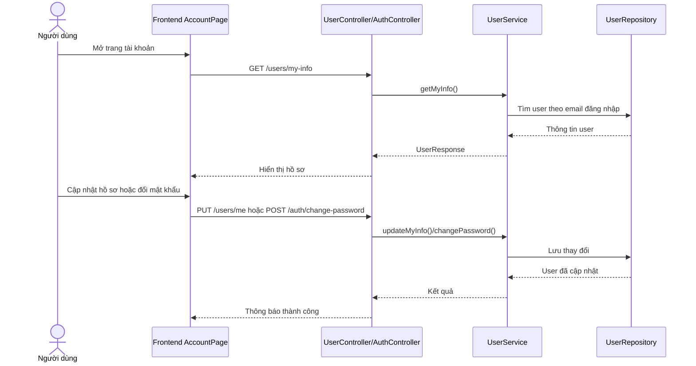

# Software Requirement Specification (SRS)

## Chức năng: Hồ sơ cá nhân và đổi mật khẩu

**Mã chức năng:** `ACCOUNT-01`  
**Trạng thái:** `Completed`  
**Người soạn thảo:** `Trịnh Duy Nam`  
**Vai trò:** `Người dùng`, `Quản trị viên`

### 1. Mô tả tổng quan (Description)
Chức năng hồ sơ cá nhân cho phép người dùng xem thông tin tài khoản của chính mình, cập nhật dữ liệu cá nhân và đổi mật khẩu khi đang đăng nhập hệ thống.

### 2. Luồng nghiệp vụ (User Workflow)
1. Người dùng đăng nhập và truy cập trang tài khoản.
2. Frontend gọi `GET /users/my-info` để lấy hồ sơ hiện tại.
3. Người dùng cập nhật `fullName`, `phone`, `address` qua `PUT /users/me`.
4. Nếu muốn đổi mật khẩu, người dùng gửi `currentPassword` và `newPassword` qua `POST /auth/change-password`.
5. Backend kiểm tra người dùng hiện tại từ security context.
6. Hệ thống lưu thay đổi và trả phản hồi thành công.

### 3. Yêu cầu dữ liệu (DataRequirements)
#### Dữ liệu vào
- `fullName`
- `phone`
- `address`
- `currentPassword`
- `newPassword`

#### Dữ liệu ra
- Thông tin người dùng sau khi cập nhật hồ sơ.
- Kết quả đổi mật khẩu thành công hoặc thất bại.

#### Dữ liệu hệ thống liên quan
- `users.full_name`
- `users.phone`
- `users.address`
- `users.password`

### 4. Ràng buộc kĩ thuật & bảo mật (Technical Constraints)
- Người dùng chỉ được sửa hồ sơ của chính mình.
- API yêu cầu xác thực JWT hợp lệ.
- Đổi mật khẩu bắt buộc kiểm tra đúng mật khẩu hiện tại.
- Mật khẩu mới phải được mã hóa trước khi lưu.

### 5. Trường hợp ngoại lệ & xử lý lỗi (Edge Cases)
- Token không hợp lệ hoặc hết hạn: không truy cập được dữ liệu hồ sơ.
- Người dùng không tồn tại: trả lỗi `USER_NOT_EXISTED`.
- Sai mật khẩu hiện tại: trả lỗi `INVALID_CURRENT_PASSWORD`.
- Dữ liệu cập nhật không hợp lệ: yêu cầu bị từ chối.

### 6. Giao diện (UI/UX)
- Trang tài khoản cần hiển thị rõ thông tin cá nhân hiện tại.
- Form cập nhật hồ sơ và đổi mật khẩu nên tách biệt để dễ thao tác.
- Khi cập nhật thành công hoặc thất bại, giao diện cần có thông báo rõ ràng.
