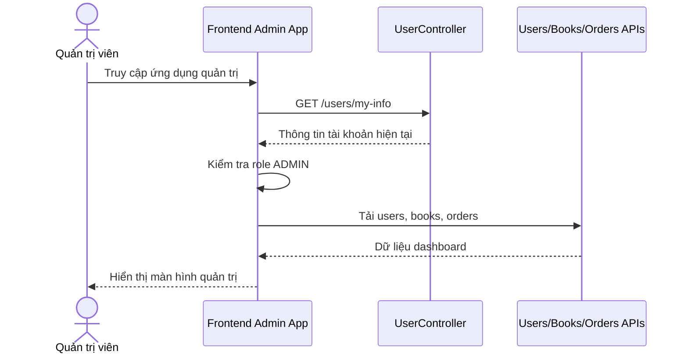

# Software Requirement Specification (SRS)

## Chức năng: Dashboard và xác thực quản trị

**Mã chức năng:** `ADMIN-UI-01`  
**Trạng thái:** `Completed`  
**Người soạn thảo:** `Trịnh Duy Nam`  
**Vai trò:** `Quản trị viên`

### 1. Mô tả tổng quan (Description)
Chức năng dashboard và xác thực quản trị cung cấp giao diện quản trị tập trung cho tài khoản có quyền `ADMIN`. Ứng dụng admin dùng token đăng nhập từ hệ thống người dùng để xác minh quyền, sau đó hiển thị các module quản lý sách, người dùng, đơn hàng và thống kê tổng quan.

### 2. Luồng nghiệp vụ (User Workflow)
1. Quản trị viên đăng nhập ở hệ thống người dùng.
2. Ứng dụng admin nhận token và lưu vào `localStorage`.
3. Frontend admin gọi `GET /users/my-info` để xác minh tài khoản hiện tại có role `ADMIN`.
4. Nếu hợp lệ, hệ thống tải dữ liệu user, book và order để hiển thị dashboard.
5. Quản trị viên điều hướng giữa các module dashboard, sách, người dùng và đơn hàng.
6. Nếu không có quyền `ADMIN`, hệ thống chặn truy cập và yêu cầu đăng nhập lại đúng tài khoản.

### 3. Yêu cầu dữ liệu (DataRequirements)
#### Dữ liệu vào
- `admin_token`
- Thông tin người dùng hiện tại

#### Dữ liệu ra
- Danh sách users
- Danh sách books
- Danh sách orders
- Thông tin chi tiết tài khoản admin

#### Dữ liệu hệ thống liên quan
- `localStorage.admin_token`
- `users.roles`
- dữ liệu từ các API quản trị

### 4. Ràng buộc kĩ thuật & bảo mật (Technical Constraints)
- Chỉ tài khoản có role `ADMIN` mới truy cập được frontend quản trị.
- Nếu token sai hoặc không đủ quyền, token bị xóa khỏi lưu trữ cục bộ.
- Frontend admin phụ thuộc trực tiếp vào các API backend đã được bảo vệ bằng JWT.

### 5. Trường hợp ngoại lệ & xử lý lỗi (Edge Cases)
- Token không hợp lệ: không vào được dashboard.
- Tài khoản không có role `ADMIN`: bị chuyển sang trạng thái unauthorized.
- Lỗi tải dữ liệu users, books hoặc orders: từng module hiển thị lỗi tương ứng.

### 6. Giao diện (UI/UX)
- Dashboard cần có điều hướng trái, topbar và khu vực nội dung trung tâm.
- Cần hiển thị được các module quản trị chính trong một giao diện thống nhất.
- Nếu không đủ quyền, giao diện cần hiển thị trang chặn truy cập rõ ràng.
