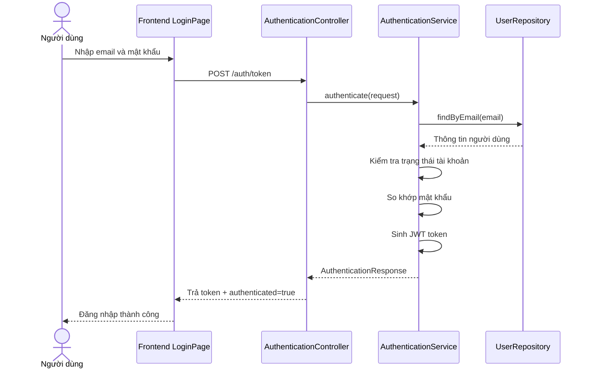

# Software Requirement Specification (SRS)

## Chức năng: Đăng nhập

**Mã chức năng:** `AUTH-LOGIN-01`  
**Trạng thái:** `Completed`  
**Người soạn thảo:** `Trịnh Duy Nam`  
**Vai trò:** `Khách`, `Người dùng`, `Quản trị viên`

### 1. Mô tả tổng quan (Description)
Chức năng đăng nhập cho phép người dùng truy cập hệ thống bằng email và mật khẩu đã đăng ký. Sau khi xác thực thành công, backend trả về JWT để frontend sử dụng khi gọi các API cần xác thực như giỏ hàng, tài khoản cá nhân, đặt hàng và khu vực quản trị.

### 2. Luồng nghiệp vụ (User Workflow)
1. Người dùng truy cập trang đăng nhập.
2. Người dùng nhập email và mật khẩu.
3. Frontend gửi yêu cầu `POST /auth/token` tới backend.
4. Backend tìm người dùng theo email.
5. Hệ thống kiểm tra tài khoản có tồn tại và đang ở trạng thái hoạt động.
6. Hệ thống so khớp mật khẩu người dùng nhập với mật khẩu đã mã hóa trong cơ sở dữ liệu.
7. Nếu hợp lệ, hệ thống sinh JWT token và trả kết quả đăng nhập thành công.
8. Frontend lưu token và cho phép người dùng truy cập các chức năng được bảo vệ.

### 3. Yêu cầu dữ liệu (Data Requirements)
#### Dữ liệu vào
- `email`: kiểu chuỗi, bắt buộc, đúng định dạng email.
- `password`: kiểu chuỗi, bắt buộc.

#### Dữ liệu ra
- `token`: JWT access token.
- `authenticated`: giá trị boolean cho biết đăng nhập thành công hay không.

#### Dữ liệu liên quan trong hệ thống
- `users.email`: định danh đăng nhập.
- `users.password`: mật khẩu đã mã hóa.
- `users.status`: trạng thái tài khoản.
- `users.roles`: danh sách vai trò để đưa vào phạm vi quyền trong token.

### 4. Ràng buộc kĩ thuật & bảo mật (Technical Constraints)
- API sử dụng endpoint `POST /auth/token`.
- Mật khẩu được kiểm tra bằng `PasswordEncoder`, không so sánh dạng văn bản thô.
- Chỉ tài khoản có trạng thái `ACTIVE` mới được đăng nhập.
- Token được sinh dưới dạng JWT và chứa thông tin quyền truy cập từ role/permission.
- Các chức năng phía sau phải gửi `Authorization: Bearer <token>`.

### 5. Trường hợp ngoại lệ & xử lý lỗi (Edge Cases)
- Email không tồn tại: hệ thống trả lỗi xác thực.
- Mật khẩu không đúng: hệ thống trả lỗi xác thực.
- Tài khoản bị vô hiệu hóa (`DISABLED`): hệ thống trả lỗi `ACCOUNT_DISABLED`.
- Dữ liệu đầu vào thiếu hoặc sai định dạng: backend từ chối yêu cầu theo validation hiện có.

### 6. Giao diện (UI/UX)
- Trang đăng nhập gồm tối thiểu các trường `email`, `password` và nút `Đăng nhập`.
- Khi đăng nhập thất bại, giao diện cần hiển thị thông báo lỗi rõ ràng.
- Khi đăng nhập thành công, giao diện chuyển người dùng đến trang phù hợp và lưu token cho các phiên làm việc tiếp theo.
- Giao diện phải hỗ trợ tốt trên desktop và mobile.
