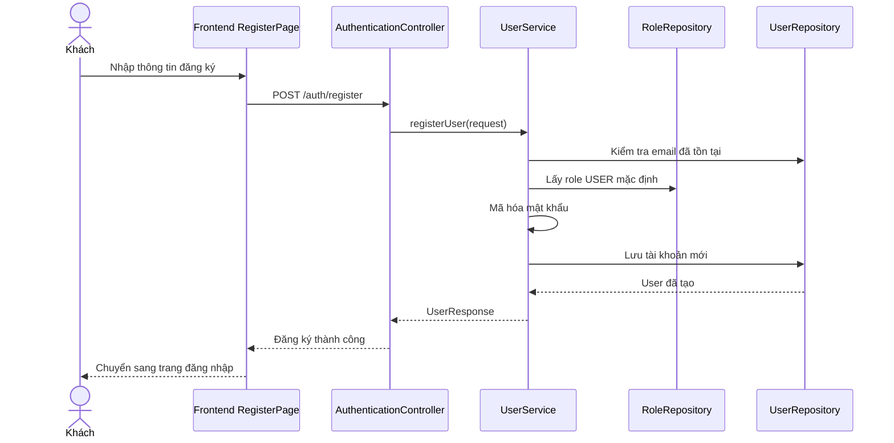

# Software Requirement Specification (SRS)

## Chức năng: Đăng ký tài khoản

**Mã chức năng:** `AUTH-REGISTER-01`  
**Trạng thái:** `Completed`  
**Người soạn thảo:** `Phạm Thị Phượng`  
**Vai trò:** `Khách`

### 1. Mô tả tổng quan (Description)
Chức năng đăng ký cho phép khách tạo mới tài khoản người dùng để sử dụng website bán sách. Sau khi đăng ký thành công, tài khoản được kích hoạt ở trạng thái hoạt động và được gán quyền người dùng mặc định để có thể đăng nhập, xem hồ sơ, thêm vào giỏ hàng và đặt hàng.

### 2. Luồng nghiệp vụ (User Workflow)
1. Khách truy cập trang đăng ký.
2. Nhập thông tin tài khoản theo form đăng ký.
3. Frontend gửi yêu cầu `POST /auth/register`.
4. Backend kiểm tra email chưa tồn tại trong hệ thống.
5. Hệ thống mã hóa mật khẩu.
6. Hệ thống gán trạng thái `ACTIVE` và role mặc định `USER`.
7. Dữ liệu tài khoản mới được lưu vào cơ sở dữ liệu.
8. Frontend thông báo đăng ký thành công và chuyển người dùng sang trang đăng nhập.

### 3. Yêu cầu dữ liệu (DataRequirements)
#### Dữ liệu vào
- `email`: kiểu chuỗi, bắt buộc, duy nhất.
- `password`: kiểu chuỗi, bắt buộc.
- `fullName`: kiểu chuỗi, bắt buộc.
- `phone`: có thể có tùy theo dữ liệu gửi từ form.

#### Dữ liệu ra
- Thông tin tài khoản người dùng sau khi tạo.

#### Dữ liệu hệ thống liên quan
- `users.email`
- `users.password`
- `users.full_name`
- `users.status`
- `users.roles`

### 4. Ràng buộc kĩ thuật & bảo mật (Technical Constraints)
- API sử dụng endpoint `POST /auth/register`.
- Email phải là duy nhất trong cơ sở dữ liệu.
- Mật khẩu phải được mã hóa trước khi lưu.
- Người dùng đăng ký công khai không tự chọn role quản trị.
- Role mặc định được gán từ dữ liệu role hệ thống.

### 5. Trường hợp ngoại lệ & xử lý lỗi (Edge Cases)
- Email đã tồn tại: hệ thống trả lỗi `USER_EXISTED`.
- Thiếu dữ liệu bắt buộc hoặc dữ liệu không hợp lệ: backend trả lỗi validation.
- Không tìm thấy role mặc định `USER`: chức năng tạo tài khoản không hoàn tất.

### 6. Giao diện (UI/UX)
- Trang đăng ký gồm các trường thông tin cá nhân cơ bản và mật khẩu.
- Cần hiển thị rõ lỗi tại form khi đăng ký thất bại.
- Khi đăng ký thành công, giao diện phải điều hướng người dùng sang trang đăng nhập.
- Form cần hiển thị tốt trên desktop và mobile.
