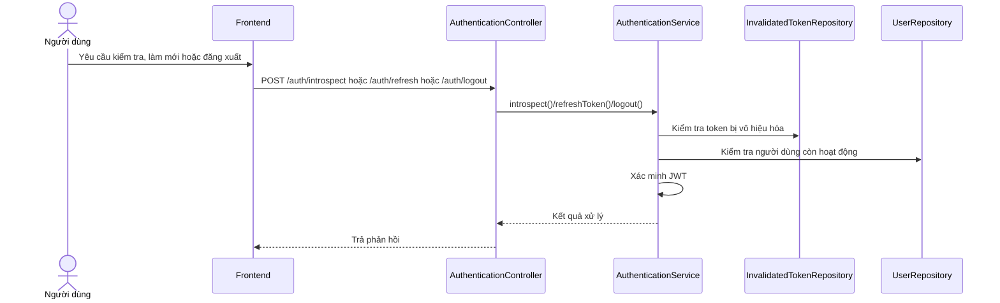

# Software Requirement Specification (SRS)

## Chức năng: Quản lý phiên xác thực

**Mã chức năng:** `AUTH-SESSION-01`  
**Trạng thái:** `Completed`  
**Người soạn thảo:** `Trịnh Duy Nam`  
**Vai trò:** `Người dùng`, `Quản trị viên`

### 1. Mô tả tổng quan (Description)
Chức năng quản lý phiên xác thực bao gồm kiểm tra token, làm mới token và đăng xuất. Đây là phần mở rộng của cơ chế đăng nhập, giúp duy trì phiên làm việc an toàn và vô hiệu hóa token khi người dùng kết thúc phiên.

### 2. Luồng nghiệp vụ (User Workflow)
1. Frontend có thể kiểm tra tính hợp lệ của token qua `POST /auth/introspect`.
2. Khi cần làm mới phiên, frontend gọi `POST /auth/refresh`.
3. Backend xác thực token cũ, kiểm tra tài khoản còn hoạt động.
4. Token cũ được đưa vào danh sách vô hiệu hóa.
5. Hệ thống sinh token mới và trả về cho frontend.
6. Khi người dùng đăng xuất, frontend gọi `POST /auth/logout`.
7. Token hiện tại được lưu vào kho token vô hiệu hóa để không thể sử dụng lại.

### 3. Yêu cầu dữ liệu (DataRequirements)
#### Dữ liệu vào
- `token`

#### Dữ liệu ra
- `valid` cho introspect
- `token` mới cho refresh
- Kết quả thành công hoặc thất bại cho logout

#### Dữ liệu hệ thống liên quan
- `invalidated_tokens`
- thông tin `users.status`
- cấu hình JWT `signerKey`, `validDuration`, `refreshableDuration`

### 4. Ràng buộc kĩ thuật & bảo mật (Technical Constraints)
- Sử dụng JWT ký bằng khóa cấu hình trong hệ thống.
- Token đã bị vô hiệu hóa không được chấp nhận lại.
- Tài khoản `DISABLED` không được refresh token.
- Khi refresh, token cũ phải bị đánh dấu vô hiệu trước khi cấp token mới.

### 5. Trường hợp ngoại lệ & xử lý lỗi (Edge Cases)
- Token hết hạn: yêu cầu bị từ chối.
- Token sai chữ ký hoặc sai định dạng: yêu cầu bị từ chối.
- Token đã logout hoặc đã refresh trước đó: yêu cầu bị từ chối.
- Người dùng bị khóa tài khoản: trả lỗi `ACCOUNT_DISABLED`.

### 6. Giao diện (UI/UX)
- Frontend không nhất thiết cần màn hình riêng cho introspect và refresh.
- Khi đăng xuất, giao diện cần xóa token cục bộ và quay về trạng thái chưa đăng nhập.
- Khi refresh thất bại, giao diện nên yêu cầu người dùng đăng nhập lại.
