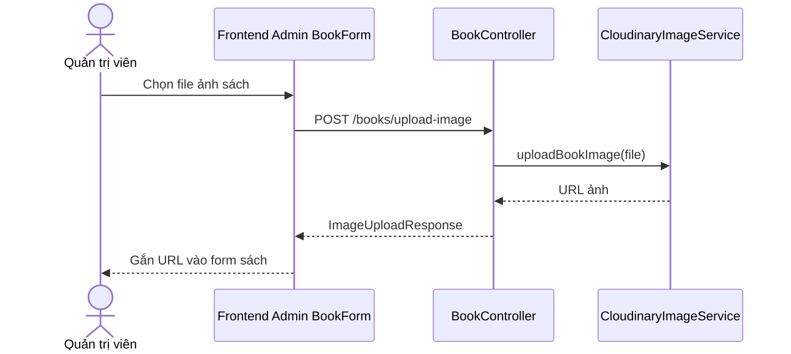

# Software Requirement Specification (SRS)

## Chức năng: Upload ảnh sách

**Mã chức năng:** `BOOK-UPLOAD-01`  
**Trạng thái:** `Completed`  
**Người soạn thảo:** `Trịnh Duy Nam`  
**Vai trò:** `Quản trị viên`

### 1. Mô tả tổng quan (Description)
Chức năng upload ảnh sách cho phép quản trị viên tải ảnh bìa sách lên dịch vụ lưu trữ ảnh và nhận về URL để gắn vào dữ liệu sách khi tạo hoặc cập nhật sách.

### 2. Luồng nghiệp vụ (User Workflow)
1. Quản trị viên mở form tạo hoặc sửa sách.
2. Chọn file ảnh từ máy.
3. Frontend gửi multipart request tới `POST /books/upload-image`.
4. Backend chuyển file cho dịch vụ upload ảnh.
5. Dịch vụ trả về URL ảnh đã lưu.
6. Frontend nhận URL và gắn vào dữ liệu sách.

### 3. Yêu cầu dữ liệu (DataRequirements)
#### Dữ liệu vào
- `file`: ảnh sách tải lên dưới dạng multipart form-data.

#### Dữ liệu ra
- `url`: đường dẫn ảnh đã upload.

#### Dữ liệu hệ thống liên quan
- cấu hình Cloudinary
- trường `books.image`

### 4. Ràng buộc kĩ thuật & bảo mật (Technical Constraints)
- Endpoint upload yêu cầu quyền `ADMIN`.
- API nhận dữ liệu kiểu `multipart/form-data`.
- Ảnh sau khi upload phải trả về URL để lưu vào sách.
- Việc upload phụ thuộc cấu hình dịch vụ ảnh bên ngoài.

### 5. Trường hợp ngoại lệ & xử lý lỗi (Edge Cases)
- File không hợp lệ hoặc upload thất bại: frontend nhận lỗi và không cập nhật ảnh.
- Tài khoản không có quyền admin: bị chặn bởi backend.
- Dịch vụ lưu trữ ảnh lỗi: không tạo được URL ảnh.

### 6. Giao diện (UI/UX)
- Form quản trị sách cần có nút chọn ảnh và trạng thái đang upload.
- Sau khi upload xong nên hiển thị preview ảnh hoặc URL.
- Nếu upload lỗi, giao diện phải báo lỗi ngay tại form.
