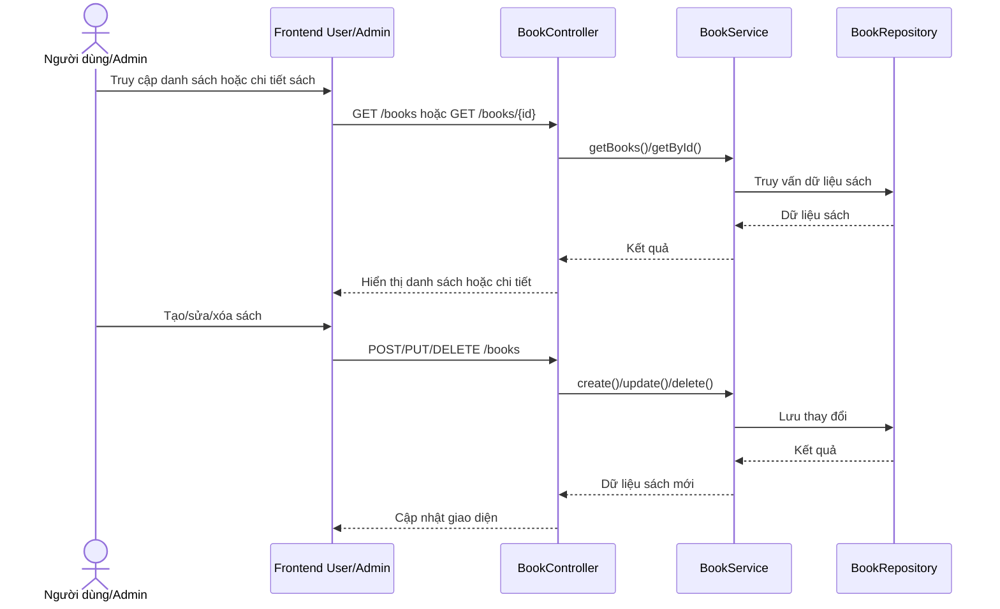

# Software Requirement Specification (SRS)

## Chức năng: Quản lý sách

**Mã chức năng:** `BOOK-MGMT-01`  
**Trạng thái:** `Completed`  
**Người soạn thảo:** `Phạm Thị Phượng`  
**Vai trò:** `Khách`, `Người dùng`, `Quản trị viên`

### 1. Mô tả tổng quan (Description)
Chức năng quản lý sách phục vụ cả hai nhóm người dùng: khách hoặc người dùng thường có thể xem danh sách, tìm kiếm và xem chi tiết sách; quản trị viên có thể thêm, cập nhật và xóa dữ liệu sách trong hệ thống.

### 2. Luồng nghiệp vụ (User Workflow)
1. Người dùng truy cập trang danh sách sách hoặc trang chủ.
2. Frontend gọi `GET /books` với từ khóa, thể loại, sắp xếp và phân trang nếu có.
3. Người dùng chọn một sách để xem chi tiết.
4. Frontend gọi `GET /books/{id}` để lấy thông tin chi tiết sách.
5. Quản trị viên có thể thêm sách mới bằng `POST /books`.
6. Quản trị viên có thể chỉnh sửa sách bằng `PUT /books/{id}`.
7. Quản trị viên có thể xóa sách bằng `DELETE /books/{id}`.

### 3. Yêu cầu dữ liệu (DataRequirements)
#### Dữ liệu vào
- `title`
- `author`
- `category`
- `price`
- `rating`
- `stock`
- `image`

#### Dữ liệu ra
- Danh sách sách phân trang.
- Chi tiết một sách.
- Dữ liệu sách sau khi tạo hoặc cập nhật.

#### Dữ liệu hệ thống liên quan
- `books.id`
- `books.title`
- `books.author`
- `books.category`
- `books.price`
- `books.rating`
- `books.stock`
- `books.image`

### 4. Ràng buộc kĩ thuật & bảo mật (Technical Constraints)
- `GET /books` và `GET /books/{id}` là public.
- `POST`, `PUT`, `DELETE` trên `/books` yêu cầu quyền `ADMIN`.
- Hệ thống hỗ trợ lọc theo `q`, `category`, `sort`, `page`, `size`.
- Kích thước trang được chuẩn hóa trong backend để tránh giá trị bất thường.

### 5. Trường hợp ngoại lệ & xử lý lỗi (Edge Cases)
- Không tìm thấy sách theo `id`: trả lỗi `BOOK_NOT_FOUND`.
- Người dùng không có quyền admin nhưng cố sửa dữ liệu: bị chặn bởi security backend.
- Tham số sắp xếp không hợp lệ: backend quay về cách sắp xếp mặc định.

### 6. Giao diện (UI/UX)
- Frontend user cần có trang danh sách sách và trang chi tiết sách.
- Cần hỗ trợ tìm kiếm, lọc thể loại, sắp xếp và phân trang hợp lý.
- Frontend admin cần có bảng quản lý sách với thao tác thêm, sửa, xóa.
- Giao diện nên hiển thị ảnh sách, giá, tồn kho và đánh giá rõ ràng.
