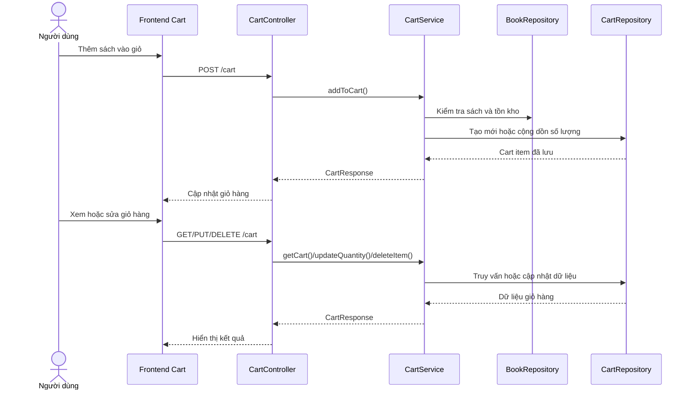

# Software Requirement Specification (SRS)

## Chức năng: Quản lý giỏ hàng

**Mã chức năng:** `CART-01`  
**Trạng thái:** `Completed`  
**Người soạn thảo:** `Phạm Thị Phượng`  
**Vai trò:** `Người dùng`

### 1. Mô tả tổng quan (Description)
Chức năng giỏ hàng cho phép người dùng đã đăng nhập lưu danh sách sách muốn mua, thay đổi số lượng từng sản phẩm, xóa từng mục hoặc làm trống toàn bộ giỏ hàng trước khi chuyển sang bước đặt hàng.

### 2. Luồng nghiệp vụ (User Workflow)
1. Người dùng chọn sách và nhấn thêm vào giỏ.
2. Frontend gọi `POST /cart` với `bookId` và `quantity`.
3. Backend kiểm tra sách tồn tại và số lượng không vượt tồn kho.
4. Nếu sách đã có trong giỏ, hệ thống cộng dồn số lượng.
5. Người dùng truy cập trang giỏ hàng để xem dữ liệu qua `GET /cart`.
6. Người dùng cập nhật số lượng bằng `PUT /cart/{id}`.
7. Người dùng xóa một mục bằng `DELETE /cart/{id}` hoặc xóa toàn bộ bằng `DELETE /cart/clear`.

### 3. Yêu cầu dữ liệu (DataRequirements)
#### Dữ liệu vào
- `bookId`
- `quantity`

#### Dữ liệu ra
- `items`
- `totalItems`
- `totalQuantity`
- `totalPrice`

#### Dữ liệu hệ thống liên quan
- `cart_items.id`
- `cart_items.user`
- `cart_items.book`
- `cart_items.quantity`
- `cart_items.price`

### 4. Ràng buộc kĩ thuật & bảo mật (Technical Constraints)
- Tất cả API giỏ hàng yêu cầu người dùng đã xác thực.
- Người dùng chỉ thao tác trên giỏ hàng của chính mình thông qua thông tin `Authentication`.
- Số lượng thêm hoặc cập nhật phải lớn hơn 0.
- Số lượng không được vượt quá tồn kho hiện tại của sách.

### 5. Trường hợp ngoại lệ & xử lý lỗi (Edge Cases)
- Sách không tồn tại: trả lỗi `BOOK_NOT_FOUND`.
- Số lượng vượt tồn kho: trả lỗi `OUT_OF_STOCK`.
- Mục giỏ hàng không tồn tại: trả lỗi `CART_ITEM_NOT_FOUND`.
- Số lượng nhỏ hơn 1: bị từ chối xử lý.

### 6. Giao diện (UI/UX)
- Trang giỏ hàng phải hiển thị đầy đủ từng sách, ảnh, số lượng, đơn giá và thành tiền.
- Người dùng cần thao tác tăng giảm số lượng thuận tiện.
- Nên có nút xóa từng mục và nút xóa toàn bộ giỏ.
- Cần hiển thị tổng tiền và điều hướng rõ ràng sang bước thanh toán.
