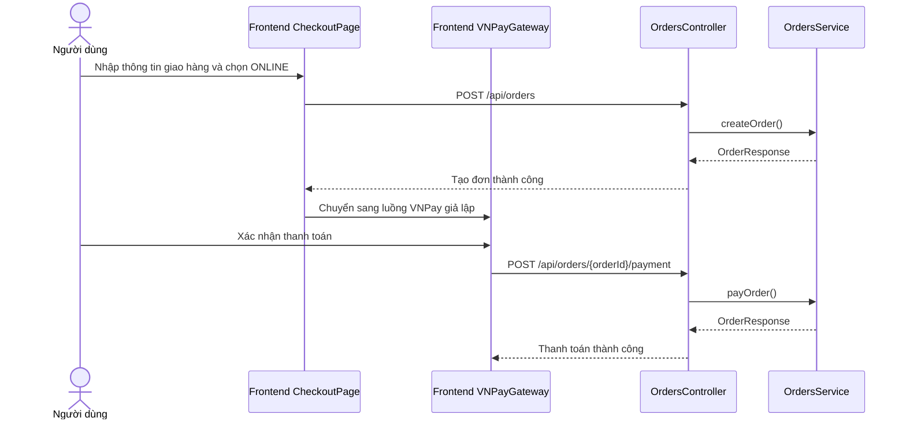

# Software Requirement Specification (SRS)

## Chức năng: Checkout và thanh toán giả lập VNPay

**Mã chức năng:** `CHECKOUT-01`  
**Trạng thái:** `Completed`  
**Người soạn thảo:** `Phạm Thị Phượng`  
**Vai trò:** `Người dùng`

### 1. Mô tả tổng quan (Description)
Chức năng checkout và thanh toán giả lập VNPay cho phép người dùng xác nhận thông tin giao hàng, chọn phương thức thanh toán và hoàn tất bước thanh toán online mô phỏng sau khi tạo đơn hàng.

### 2. Luồng nghiệp vụ (User Workflow)
1. Người dùng truy cập trang checkout từ giỏ hàng.
2. Nhập số điện thoại, địa chỉ và các thông tin liên quan.
3. Chọn phương thức thanh toán `ONLINE` hoặc `COD`.
4. Frontend gọi `POST /api/orders` để tạo đơn.
5. Nếu chọn online, giao diện chuyển sang màn hình thanh toán giả lập VNPay.
6. Người dùng xác nhận thanh toán.
7. Frontend gọi `POST /api/orders/{orderId}/payment` để cập nhật thanh toán.
8. Hệ thống đánh dấu đơn đã thanh toán và cập nhật trạng thái phù hợp.

### 3. Yêu cầu dữ liệu (DataRequirements)
#### Dữ liệu vào
- `phone`
- `address`
- `latitude`
- `longitude`
- `paymentMethod`

#### Dữ liệu ra
- `orderId`
- `paymentStatus`
- `paymentReference`
- `status`

#### Dữ liệu hệ thống liên quan
- `CheckoutPage`
- `VNPayGateway`
- `OrderRequest`
- `OrderPaymentRequest`

### 4. Ràng buộc kĩ thuật & bảo mật (Technical Constraints)
- Chức năng checkout yêu cầu người dùng đã đăng nhập.
- Chỉ phương thức `ONLINE` mới đi qua luồng thanh toán giả lập.
- API thanh toán không cho phép thanh toán lặp lại cho đơn đã `PAID`.
- Thanh toán giả lập vẫn phải tuân theo trạng thái đơn hàng ở backend.

### 5. Trường hợp ngoại lệ & xử lý lỗi (Edge Cases)
- Giỏ hàng trống: không tạo được đơn.
- Dữ liệu giao hàng thiếu hoặc sai: backend từ chối tạo đơn.
- Người dùng thanh toán lại đơn đã trả tiền: trả lỗi `PAYMENT_ALREADY_COMPLETED`.
- Chọn phương thức không hỗ trợ tại API thanh toán: trả lỗi `PAYMENT_METHOD_NOT_SUPPORTED`.

### 6. Giao diện (UI/UX)
- Trang checkout cần hiển thị tóm tắt đơn hàng, địa chỉ và phương thức thanh toán.
- Luồng VNPay giả lập phải tách rõ khỏi trang checkout để người dùng dễ hiểu tiến trình.
- Sau khi thanh toán thành công hoặc thất bại, giao diện cần thông báo rõ trạng thái.
