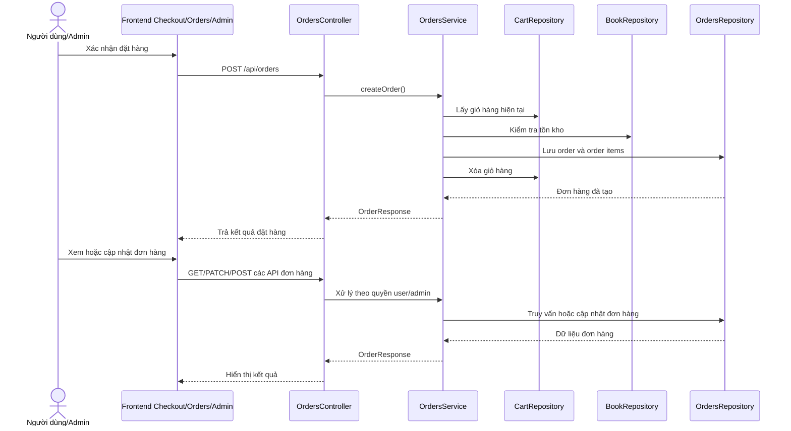

# Software Requirement Specification (SRS)

## Chức năng: Đặt hàng và quản lý đơn hàng

**Mã chức năng:** `ORDER-01`  
**Trạng thái:** `Completed`  
**Người soạn thảo:** `Phạm Thị Phượng`  
**Vai trò:** `Người dùng`, `Quản trị viên`

### 1. Mô tả tổng quan (Description)
Chức năng đơn hàng cho phép người dùng tạo đơn từ giỏ hàng, xem danh sách đơn hàng của mình, xem chi tiết, thanh toán online mô phỏng, hủy đơn khi hợp lệ. Quản trị viên có thể xem toàn bộ đơn hàng, xem chi tiết và cập nhật trạng thái xử lý đơn.

### 2. Luồng nghiệp vụ (User Workflow)
1. Người dùng vào trang thanh toán và nhập thông tin nhận hàng.
2. Frontend gọi `POST /api/orders` để tạo đơn.
3. Backend kiểm tra giỏ hàng, tồn kho, phương thức thanh toán và dữ liệu đơn.
4. Hệ thống tạo order, tạo order items, trừ tồn kho và xóa giỏ hàng.
5. Người dùng xem danh sách đơn bằng `GET /api/orders`.
6. Người dùng xem chi tiết từng đơn bằng `GET /api/orders/{orderId}`.
7. Với đơn online chưa thanh toán, người dùng có thể gọi `POST /api/orders/{orderId}/payment`.
8. Với đơn ở trạng thái phù hợp, người dùng có thể gọi `POST /api/orders/{orderId}/cancel`.
9. Quản trị viên dùng `GET /api/orders/admin`, `GET /api/orders/admin/{orderId}` và `PATCH /api/orders/admin/{orderId}/status` để quản lý đơn hàng toàn hệ thống.

### 3. Yêu cầu dữ liệu (DataRequirements)
#### Dữ liệu vào
- `phone`
- `address`
- `latitude`
- `longitude`
- `paymentMethod`
- `status` khi admin cập nhật trạng thái

#### Dữ liệu ra
- `orderId`
- `customerName`
- `customerEmail`
- `items`
- `totalPrice`
- `status`
- `paymentMethod`
- `paymentStatus`
- `paymentReference`

#### Dữ liệu hệ thống liên quan
- `orders`
- `order_items`
- `books.stock`
- `cart_items`

### 4. Ràng buộc kĩ thuật & bảo mật (Technical Constraints)
- Tất cả API đơn hàng yêu cầu xác thực.
- API quản trị đơn hàng yêu cầu quyền `ADMIN`.
- Không thể tạo đơn nếu giỏ hàng rỗng.
- Không thể tạo đơn nếu tồn kho không đủ.
- Chỉ hỗ trợ thanh toán qua API `payment` với phương thức `ONLINE`.
- Luồng chuyển trạng thái đơn hàng phải đúng quy tắc nghiệp vụ backend.

### 5. Trường hợp ngoại lệ & xử lý lỗi (Edge Cases)
- Giỏ hàng rỗng: trả lỗi `CART_EMPTY`.
- Sách hết hàng: trả lỗi `OUT_OF_STOCK`.
- Đơn hàng không tồn tại: trả lỗi `ORDER_NOT_FOUND`.
- Đơn đã thanh toán rồi nhưng tiếp tục thanh toán lại: trả lỗi `PAYMENT_ALREADY_COMPLETED`.
- Hủy đơn không đúng trạng thái: trả lỗi `ORDER_CANNOT_BE_CANCELLED`.
- Chuyển trạng thái admin sai luồng: trả lỗi `ORDER_STATUS_TRANSITION_NOT_ALLOWED`.

### 6. Giao diện (UI/UX)
- Frontend user cần có trang checkout, danh sách đơn và chi tiết đơn hàng.
- Cần hiển thị rõ trạng thái đơn và trạng thái thanh toán.
- Với đơn online, giao diện phải có luồng thanh toán rõ ràng.
- Frontend admin cần có màn hình danh sách đơn, xem chi tiết và cập nhật trạng thái nhanh.
