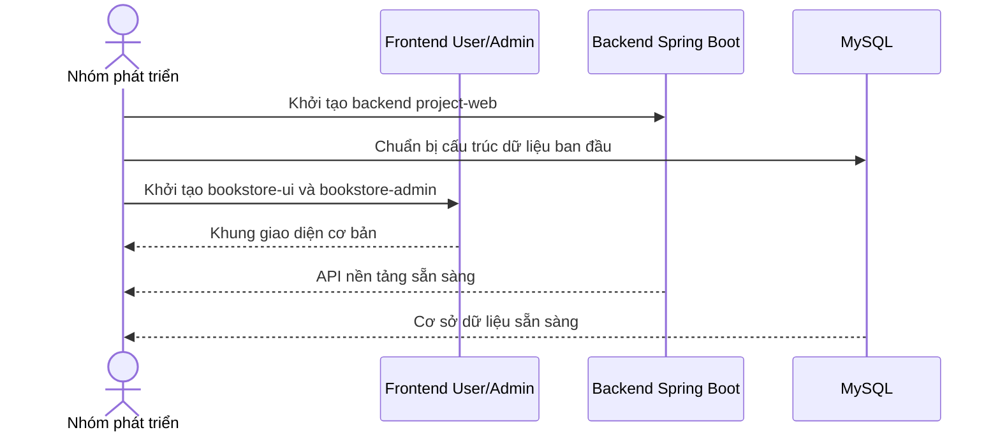

# Software Requirement Specification (SRS)

## Chức năng: Khởi tạo hệ thống và giao diện cơ bản

**Mã chức năng:** `SYS-INIT-01`  
**Trạng thái:** `Completed`  
**Người soạn thảo:** `Trịnh Duy Nam`  
**Vai trò:** `Nhóm phát triển`, `Người dùng`, `Quản trị viên`

### 1. Mô tả tổng quan (Description)
Đây là hạng mục nền tảng của dự án, bao gồm khởi tạo cấu trúc backend, frontend người dùng, frontend quản trị, cấu hình kết nối dữ liệu và thiết kế bộ giao diện cơ bản để làm cơ sở cho các chức năng nghiệp vụ phía sau.

### 2. Luồng nghiệp vụ (User Workflow)
1. Khởi tạo backend Spring Boot cho API chính.
2. Khởi tạo frontend người dùng bằng React.
3. Khởi tạo frontend quản trị bằng React + Vite.
4. Thiết lập cấu trúc thư mục, router cơ bản và cấu hình API.
5. Tạo các layout và thành phần giao diện nền tảng cho user và admin.
6. Chuẩn bị môi trường chạy local và docker cho backend.

### 3. Yêu cầu dữ liệu (DataRequirements)
#### Dữ liệu vào
- Cấu hình môi trường backend.
- Cấu hình frontend.
- Cấu hình database và JWT.

#### Dữ liệu ra
- Cấu trúc project hoàn chỉnh.
- Các ứng dụng frontend và backend có thể chạy.

#### Dữ liệu hệ thống liên quan
- `backend/project-web`
- `Frontend/bookstore-ui`
- `Frontend/bookstore-admin`
- `application.yaml`
- `docker-compose.yml`

### 4. Ràng buộc kĩ thuật & bảo mật (Technical Constraints)
- Backend sử dụng Spring Boot, Spring Security, JPA và MySQL.
- Frontend user và admin tách thành hai ứng dụng riêng.
- Cần cấu hình JWT và kết nối database ngay từ nền tảng ban đầu.
- Kiến trúc phải hỗ trợ mở rộng cho xác thực, sách, giỏ hàng và đơn hàng.

### 5. Trường hợp ngoại lệ & xử lý lỗi (Edge Cases)
- Cấu hình môi trường sai làm backend không kết nối được database.
- Cấu hình API sai làm frontend không gọi được backend.
- Thiếu role hoặc dữ liệu seed làm các chức năng phân quyền không hoạt động đúng.

### 6. Giao diện (UI/UX)
- Giao diện cơ bản cần có khung trang chủ, form đăng nhập/đăng ký và layout điều hướng.
- Giao diện admin cần có sidebar, topbar và vùng nội dung chính.
- Thiết kế ban đầu phải đủ rõ để mở rộng thành các chức năng chính sau này.
