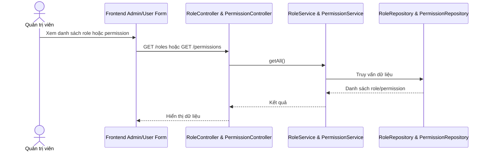

# Software Requirement Specification (SRS)

## Chức năng: Quản lý role và permission

**Mã chức năng:** `AUTHZ-01`  
**Trạng thái:** `Completed`  
**Người soạn thảo:** `Trịnh Duy Nam`  
**Vai trò:** `Quản trị viên`

### 1. Mô tả tổng quan (Description)
Chức năng role và permission phục vụ quản lý phân quyền hệ thống. Role được dùng để gán quyền cho người dùng, còn permission là đơn vị quyền chi tiết hơn được gắn vào role và đưa vào token xác thực.

### 2. Luồng nghiệp vụ (User Workflow)
1. Quản trị viên hoặc hệ thống truy cập danh sách role bằng `GET /roles`.
2. Quản trị viên hoặc hệ thống truy cập danh sách permission bằng `GET /permissions`.
3. Có thể tạo mới role bằng `POST /roles`.
4. Có thể tạo mới permission bằng `POST /permissions`.
5. Có thể xóa role hoặc permission bằng API xóa tương ứng.
6. Dữ liệu role được dùng trong màn hình tạo hoặc sửa người dùng.

### 3. Yêu cầu dữ liệu (DataRequirements)
#### Dữ liệu vào
- `role.name`
- `role.description`
- `role.permissions`
- `permission.name`
- `permission.description`

#### Dữ liệu ra
- Danh sách role.
- Danh sách permission.
- Dữ liệu role hoặc permission sau khi tạo.

#### Dữ liệu hệ thống liên quan
- `roles`
- `permissions`
- `users.roles`

### 4. Ràng buộc kĩ thuật & bảo mật (Technical Constraints)
- Dữ liệu role và permission ảnh hưởng trực tiếp tới phân quyền hệ thống.
- Claim `scope` trong JWT được xây từ role và permission của người dùng.
- Các API này cần được vận hành trong ngữ cảnh quản trị hệ thống.

### 5. Trường hợp ngoại lệ & xử lý lỗi (Edge Cases)
- Tên role hoặc permission trùng: thao tác tạo mới có thể thất bại.
- Xóa role hoặc permission không tồn tại: hệ thống trả lỗi theo backend hiện tại.
- Dữ liệu role thiếu permission mong muốn có thể làm người dùng không truy cập được chức năng tương ứng.

### 6. Giao diện (UI/UX)
- Ở frontend admin, danh sách role cần hiển thị rõ để dùng trong form người dùng.
- Nên phân biệt rõ role và permission để tránh gán sai quyền.
- Nếu tạo hoặc xóa thất bại, giao diện cần thông báo rõ nguyên nhân.
