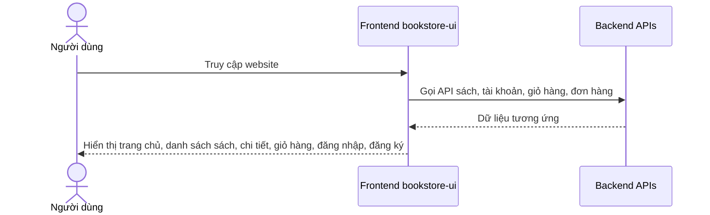

# Software Requirement Specification (SRS)

## Chức năng: Giao diện người dùng

**Mã chức năng:** `UI-USER-01`  
**Trạng thái:** `Completed`  
**Người soạn thảo:** `Trịnh Duy Nam`  
**Vai trò:** `Khách`, `Người dùng`

### 1. Mô tả tổng quan (Description)
Chức năng giao diện người dùng bao gồm các màn hình chính của website bán sách dành cho khách và người dùng đã đăng nhập: trang chủ, danh sách sách, chi tiết sách, giỏ hàng, đăng nhập, đăng ký, tài khoản và lịch sử đơn hàng.

### 2. Luồng nghiệp vụ (User Workflow)
1. Khách truy cập trang chủ để xem sách nổi bật.
2. Người dùng mở trang danh sách sách và tìm kiếm sách phù hợp.
3. Người dùng xem chi tiết sách trước khi mua.
4. Người dùng đăng nhập hoặc đăng ký để sử dụng giỏ hàng và đặt hàng.
5. Sau khi đăng nhập, người dùng vào giỏ hàng, tài khoản và đơn hàng của mình.

### 3. Yêu cầu dữ liệu (DataRequirements)
#### Dữ liệu vào
- Dữ liệu sách từ backend.
- Dữ liệu tài khoản hiện tại.
- Dữ liệu giỏ hàng và đơn hàng.

#### Dữ liệu ra
- Các màn hình đã render với dữ liệu tương ứng.

#### Dữ liệu hệ thống liên quan
- `Home`
- `BookList`
- `BookDetail`
- `Cart`
- `LoginPage`
- `RegisterPage`
- `AccountPage`
- `OrderListPage`
- `OrderDetailPage`

### 4. Ràng buộc kĩ thuật & bảo mật (Technical Constraints)
- Một số route như giỏ hàng, tài khoản, checkout, đơn hàng yêu cầu đăng nhập.
- Frontend dùng cơ chế `PrivateRoute` để chặn truy cập trái phép.
- Dữ liệu phải đồng bộ với token và trạng thái người dùng hiện tại.

### 5. Trường hợp ngoại lệ & xử lý lỗi (Edge Cases)
- Người dùng chưa đăng nhập nhưng truy cập route bảo vệ: bị chuyển hướng.
- API lỗi hoặc token hết hạn: giao diện phải xử lý và thông báo phù hợp.
- Sách không tồn tại hoặc dữ liệu rỗng: trang phải hiển thị trạng thái an toàn.

### 6. Giao diện (UI/UX)
- Có thanh điều hướng rõ ràng giữa trang chủ, sách, giỏ hàng, tài khoản và đơn hàng.
- Giao diện cần responsive cho desktop và mobile.
- Thông tin sách cần trình bày rõ: ảnh, tên, giá, đánh giá, tồn kho.
- Các form đăng nhập/đăng ký cần đơn giản và dễ thao tác.
