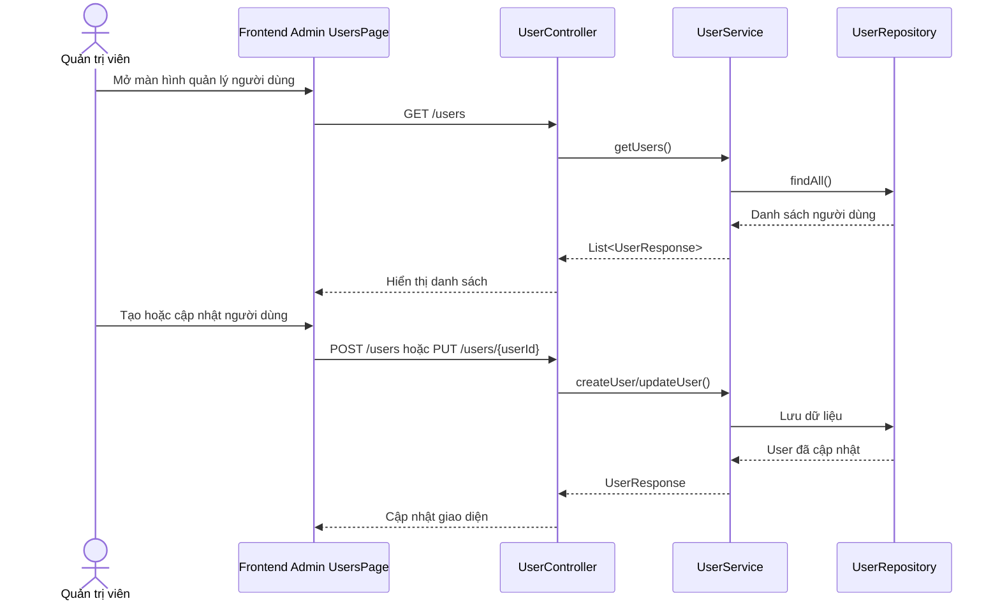

# Software Requirement Specification (SRS)

## Chức năng: Quản lý người dùng

**Mã chức năng:** `USER-MGMT-01`  
**Trạng thái:** `Completed`  
**Người soạn thảo:** `Phạm Thị Phượng`  
**Vai trò:** `Quản trị viên`

### 1. Mô tả tổng quan (Description)
Chức năng quản lý người dùng cho phép quản trị viên xem danh sách tài khoản, xem chi tiết, tạo tài khoản mới, cập nhật thông tin, đổi vai trò, thay đổi trạng thái hoạt động và xóa người dùng khỏi hệ thống.

### 2. Luồng nghiệp vụ (User Workflow)
1. Quản trị viên truy cập giao diện quản lý người dùng.
2. Hệ thống tải danh sách người dùng bằng `GET /users`.
3. Quản trị viên có thể xem chi tiết từng tài khoản bằng `GET /users/{userId}`.
4. Quản trị viên có thể tạo tài khoản mới bằng `POST /users`.
5. Quản trị viên có thể cập nhật họ tên và danh sách role bằng `PUT /users/{userId}`.
6. Quản trị viên có thể khóa hoặc mở tài khoản bằng `PATCH /users/{userId}/status`.
7. Quản trị viên có thể xóa tài khoản bằng `DELETE /users/{userId}`.

### 3. Yêu cầu dữ liệu (DataRequirements)
#### Dữ liệu vào
- `email`
- `password`
- `fullName`
- `roles`
- `status`

#### Dữ liệu ra
- `UserResponse` chứa thông tin tài khoản, trạng thái và role.

#### Dữ liệu hệ thống liên quan
- `users.id`
- `users.email`
- `users.full_name`
- `users.status`
- `users.roles`

### 4. Ràng buộc kĩ thuật & bảo mật (Technical Constraints)
- Các API quản lý người dùng yêu cầu quyền `ADMIN`.
- Tạo người dùng dùng endpoint `POST /users`.
- Cập nhật người dùng dùng endpoint `PUT /users/{userId}`.
- Đổi trạng thái dùng endpoint `PATCH /users/{userId}/status`.
- Mật khẩu của user tạo mới phải được mã hóa trước khi lưu.
- Role được lấy từ dữ liệu role hiện có trong hệ thống.

### 5. Trường hợp ngoại lệ & xử lý lỗi (Edge Cases)
- User không tồn tại: trả lỗi `USER_NOT_EXISTED`.
- Email trùng khi tạo mới: trả lỗi `USER_EXISTED`.
- Trạng thái không hợp lệ: trả lỗi `INVALID_USER_STATUS`.
- Không đủ quyền truy cập: bị chặn bởi security backend.

### 6. Giao diện (UI/UX)
- Màn hình quản lý hiển thị danh sách người dùng dạng bảng.
- Có thao tác tạo mới, sửa, khóa hoặc mở tài khoản, xóa.
- Giao diện nên hiển thị rõ role và trạng thái của từng tài khoản.
- Khi thao tác cập nhật hoặc xóa, giao diện cần phản hồi thành công hoặc lỗi rõ ràng.
